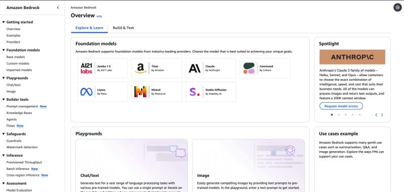
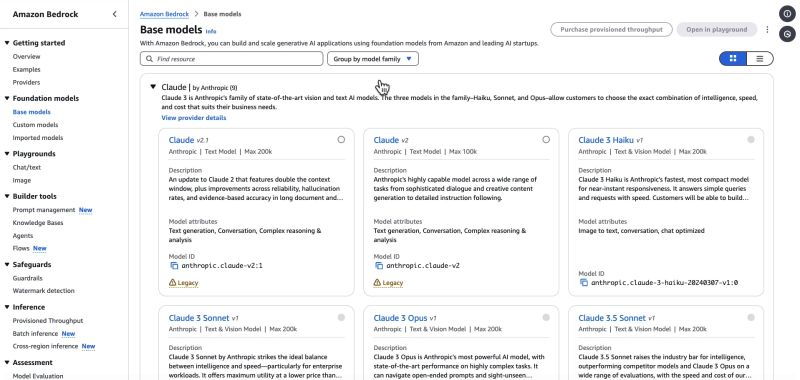
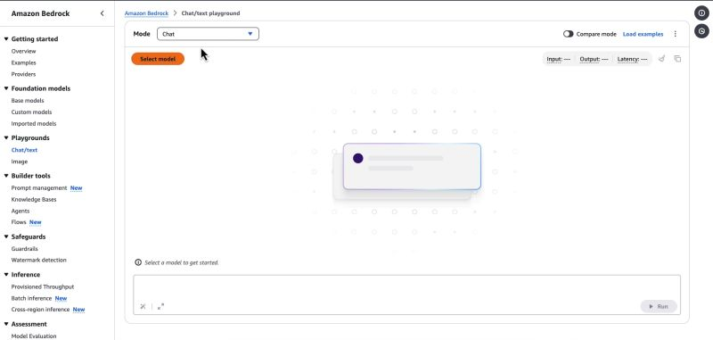
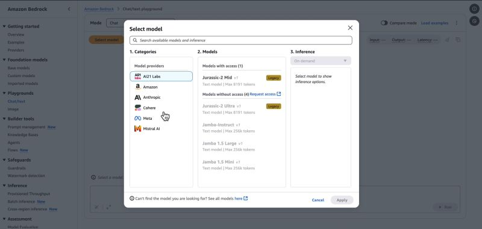

# ☁️ Amazon Bedrock Fine-Tuning & Provisioned Throughput Guide

A practical hands-on guide for exploring Amazon Bedrock, fine-tuning foundation models, and configuring provisioned throughput for production-ready GenAI workloads on AWS.

This project focuses on the workflow required to move from model access to model customization and stable low-latency inference using AWS-managed Bedrock capabilities.

---

## 👨‍💻 Project Author

**Abhishek Kumar**  
Aspiring Cloud & DevOps Engineer

---

## 📌 Project Overview

Amazon Bedrock is AWS's fully managed service for foundation models. It provides a single interface to access models from leading AI providers and supports use cases such as:

- text generation
- summarization
- classification
- chat assistants
- document understanding
- fine-tuning for domain-specific behavior
- provisioned throughput for predictable performance

This guide covers:

- enabling Bedrock access in AWS
- understanding model availability and region support
- creating IAM permissions
- exploring fine-tuning concepts
- setting up provisioned throughput
- testing model performance and security posture

---

## 🎯 Objectives

By the end of this project, you should be able to:

- open Amazon Bedrock in the AWS console
- request and verify model access
- configure IAM permissions for Bedrock usage
- understand the difference between fine-tuning and inference
- configure provisioned throughput for high-demand workloads
- apply AWS best practices for cost, security, and operational readiness

---

## ✅ Prerequisites

Before starting, make sure you have:

- A valid AWS account
- Billing enabled for the account
- Access to the AWS Management Console
- IAM permissions to manage Bedrock and IAM policies
- A supported AWS region
- A basic understanding of AWS Identity and Access Management (IAM)

> Important: Bedrock model access and pricing vary by region and model family. Always check current support before deployment.

---

## 🧠 Key AWS Bedrock Concepts

| Concept | Description |
|---|---|
| Amazon Bedrock | Managed service for foundation models on AWS |
| Foundation Model | Pretrained AI model hosted by AWS or model provider |
| Fine-Tuning | Adapting a model to a domain or task with custom data |
| Provisioned Throughput | Dedicated model capacity for consistent latency and throughput |
| IAM Policy | Controls who can invoke or manage Bedrock resources |
| Region Support | Bedrock availability depends on model and region |
| Inference | Using a trained or base model to generate output |

---

## 🏗️ Architecture Overview

```text
User / Application
      │
      ▼
AWS Management Console / SDK / API
      │
      ▼
IAM Permissions
      │
      ▼
Amazon Bedrock
      │
  ├── Model Access
  ├── Foundation Model Runtime
  ├── Fine-Tuning Workflow
  └── Provisioned Throughput
```

This workflow helps teams:

- access models safely and securely
- fine-tune behavior for domain-specific tasks
- reserve inference capacity for production workloads
- monitor cost and model usage proactively

---

## 📚 Table of Contents

1. [Sign In to AWS Console](#1-sign-in-to-aws-console)
2. [Open Amazon Bedrock](#2-open-amazon-bedrock)
3. [Check Region and Model Availability](#3-check-region-and-model-availability)
4. [Request Model Access](#4-request-model-access)
5. [Set Up IAM Permissions](#5-set-up-iam-permissions)
6. [Explore Fine-Tuning Options](#6-explore-fine-tuning-options)
7. [Prepare Training Data](#7-prepare-training-data)
8. [Create and Run Fine-Tuning Job](#8-create-and-run-fine-tuning-job)
9. [Configure Provisioned Throughput](#9-configure-provisioned-throughput)
10. [Test the Model](#10-test-the-model)
11. [Review Cost and Billing](#11-review-cost-and-billing)
12. [Security and Best Practices](#12-security-and-best-practices)
13. [Troubleshooting](#13-troubleshooting)
14. [Key Takeaways](#14-key-takeaways)

---

## 🪜 Step-by-Step Setup Guide

### 1. Sign In to AWS Console

1. Open the AWS Management Console.
2. Sign in using your AWS account credentials.
3. Make sure the account is active and that billing is configured.
4. Choose the correct AWS region before opening Bedrock services.

> The first AWS sign-in image from the LinkedIn post was not available for local download because of LinkedIn access restrictions, but the remaining Bedrock workflow screenshots were captured and stored locally below.

---

### 2. Open Amazon Bedrock

1. In the AWS Console search bar, type `Bedrock`.
2. Click on the Amazon Bedrock service.
3. Review the dashboard and ensure your region supports the models you want to use.



---

### 3. Check Region and Model Availability

Before starting fine-tuning or throughput configuration, verify:

- the selected region supports the model
- the model is available in that region
- the model supports the use case you want

Common considerations:

- some models are available only in selected regions
- fine-tuning support may differ by model family
- throughput and cost vary by model and region



---

### 4. Request Model Access

Amazon Bedrock often requires access approval before a model can be used.

#### Typical steps

1. Go to **Amazon Bedrock** → **Model access**.
2. Review the available foundation models.
3. Select the models you want to use.
4. Click **Request model access**.
5. Wait for AWS to approve the access request.


---

### 5. Set Up IAM Permissions

A secure Bedrock workflow requires IAM policies that allow only necessary actions.

Example policy for model invocation:

```json
{
  "Version": "2012-10-17",
  "Statement": [
    {
      "Sid": "BedrockModelAccess",
      "Effect": "Allow",
      "Action": [
        "bedrock:InvokeModel",
        "bedrock:InvokeModelWithResponseStream",
        "bedrock:GetFoundationModel",
        "bedrock:ListFoundationModels"
      ],
      "Resource": "*"
    }
  ]
}
```

#### Recommended approach

- create a dedicated IAM user or role
- attach least-privilege policies
- avoid using the root account for regular operations
- rotate access credentials as needed



---

### 6. Explore Fine-Tuning Options

Fine-tuning allows you to adapt a foundation model to better match your task, domain, or industry requirements.

Typical use cases:

- customer support assistant behavior
- domain-specific summarization
- industry classification and labeling
- specialized chatbot tone and instructions

#### Important concept

Fine-tuning is useful when you need the model to behave consistently for a defined domain, not just a one-off prompt.

> This phase is typically configured from the Bedrock model customization and fine-tuning console, depending on the model support in the selected region.

---

### 7. Prepare Training Data

A good fine-tuning job starts with well-prepared data.

#### Best practices for dataset preparation

- use clear, structured examples
- keep labels consistent
- remove duplicate or noisy examples
- include representative real-world inputs
- align the format with the target use case

#### Example dataset format

```json
{
  "input": "Summarize this support ticket in 2 sentences.",
  "output": "The customer reports a login issue after the latest update. The issue is being investigated by the engineering team."
}
```

This format should be consistent across the dataset for better fine-tuning quality.

---

### 8. Create and Run Fine-Tuning Job

Once the data is ready:

1. Open the Bedrock console.
2. Navigate to the relevant fine-tuning section.
3. Select the model to fine-tune.
4. Upload or configure the training dataset.
5. Define output settings and training parameters.
6. Start the job.
7. Monitor status and validation results.

#### Key items to review

- dataset quality
- training duration
- model output quality
- cost estimates before running longer jobs

---

### 9. Configure Provisioned Throughput

Provisioned throughput is used when you need consistent model performance and lower latency for sustained traffic.

It is especially helpful for:

- production applications
- high-volume traffic workloads
- latency-sensitive AI services
- predictable model performance requirements

#### Typical setup flow

1. Go to Bedrock or the model capacity configuration section.
2. Select the model and throughput option.
3. Choose the required capacity or performance level.
4. Review the cost and capacity impact.
5. Confirm the configuration.

#### Why it matters

Provisioned throughput gives a predictable inference environment, which is often more suitable than standard on-demand usage in production workloads.

> This configuration is often shown in the Bedrock capacity or throughput management area and may differ slightly by model family and region.

---

### 10. Test the Model

After fine-tuning and provisioned throughput setup, validate the model with real prompts.

#### Example prompt

```text
You are a cloud support assistant. Provide a concise but helpful response to a customer asking why their AWS Bedrock model is unavailable in a specific region.
```

#### What to check

- accuracy and consistency
- relevance to the target domain
- response speed
- prompt stability
- hallucination risk



---

### 11. Review Cost and Billing

Amazon Bedrock can involve different cost drivers, including:

- model invocation charges
- training or fine-tuning cost
- provisioned throughput cost
- data transfer or monitoring cost

#### Cost awareness best practices

- set billing alerts
- monitor usage after each test run
- compare on-demand and throughput pricing models
- stop or scale down unused capacity
- validate the cost before production rollout

---

## 🔐 Security and Best Practices

Use the following best practices when working with Amazon Bedrock:

- follow least-privilege IAM access
- do not use root credentials for normal tasks
- monitor billing and model usage regularly
- restrict access to approved users and roles
- validate data before training or fine-tuning
- test prompts safely before exposing them to end users
- keep model prompts and output handling secure
- review region-specific governance and compliance policies

---

## 🚨 Troubleshooting

### Model access denied

- verify the region supports the model
- request access from the Bedrock model access page
- ensure IAM permissions are correct

### Fine-tuning job fails

- verify the dataset format is valid
- check training data size and quality
- review AWS console error messages
- validate model support for fine-tuning

### Throughput configuration issues

- check model and region compatibility
- verify capacity availability
- examine pricing, quotas, and service limits

### High cost surprises

- review cost explorer and Bedrock usage
- stop unnecessary jobs
- reduce test frequency
- use budget alerts

---

## 📦 Recommended Project Folder Structure

```text
Bedrock-Fine-Tuning-&-Provisioned-Throughput-Guide/
├── README.md
├── screenshots/
│   ├── 01-aws-console.png
│   ├── 02-bedrock-dashboard.png
│   ├── 03-model-access.png
│   ├── 04-iam-policy.png
│   ├── 05-fine-tuning.png
│   ├── 06-provisioned-throughput.png
│   └── 07-testing-output.png
└── notes/
```

---

## 💡 Real-World Use Cases

Amazon Bedrock is useful for:

- AI-powered support chatbots
- enterprise knowledge assistants
- summarization of docs and tickets
- AI workflows for internal teams
- domain-specific customer experiences
- low-latency, reliable inference for production apps

---

## 📈 What I Learned

This project helps build understanding in the following areas:

- how Amazon Bedrock works in AWS
- how to safely request and access foundation models
- how fine-tuning differs from standard inference
- how provisioned throughput improves performance for production use cases
- why IAM, cost monitoring, and region support matter for GenAI workloads

---

## 🎓 Key Takeaways

### Security First
Protect Bedrock access with controlled IAM policies and monitored roles.

### Performance Planning
Provisioned throughput is useful when stable latency and predictable capacity matter.

### Cost Awareness
GenAI workloads can scale quickly. Review logs, usage, and billing regularly.

### Build for Real Use Cases
Fine-tuning and throughput choices should align with business and technical requirements.

---

## ✅ Final Notes

Amazon Bedrock offers a powerful foundation for building modern Generative AI applications on AWS. Starting with access and model testing, then moving into fine-tuning and provisioned throughput, helps you create a workflow that is both practical and production-aware.

This project is a strong starting point for anyone wanting to learn AWS GenAI architecture, model access, and managed AI infrastructure.

---

## 📝 Maintenance Notes

This README is designed to remain easy to maintain and extend.

To keep it well maintained:

- add real screenshots of each step after setup
- update model names and availability when AWS changes the catalog
- update region-specific guidance as needed
- note pricing changes and service limits
- add examples for your own custom projects later

---

*This guide is intended for learning, experimentation, and secure hands-on exploration of Amazon Bedrock.*
