# Amazon Bedrock Guardrails

Configure Amazon Bedrock Guardrails to add safety controls, topic restrictions, and sensitive-data protection to generative AI applications.

This project follows the step-by-step workflow from the original LinkedIn post by Abhishek Kumar:

[Open the source LinkedIn post](https://www.linkedin.com/posts/abhiabhishekoffl_generativeai-aws-amazonbedrock-ugcPost-7504243224681627648-s3Dc/?utm_source=share&utm_medium=member_desktop&rcm=ACoAAD7-FrYBuu4G1Id4rSpwmjqVs_RTbyQ-DLY)

> The screenshots below were downloaded from the original LinkedIn post and are included locally so they render on GitHub. The source post remains linked for attribution.

## What You Will Build

You will create and test a Bedrock Guardrail that can:

- Filter harmful content such as hate, violence, and misconduct
- Block conversations about defined denied topics
- Mask or block personally identifiable information (PII)
- Return custom fallback messages when a request or response is blocked
- Provide trace information for testing and evaluation

## Prerequisites

- An AWS account with billing enabled
- Permission to use Amazon Bedrock and create guardrails
- A supported AWS Region with Amazon Bedrock Guardrails available
- Access to the Amazon Bedrock console
- A foundation model enabled for testing

> AWS console labels and feature availability can change. Confirm the current Guardrails availability and pricing in your selected Region before creating production resources.

## Architecture

```text
User prompt
    |
    v
Amazon Bedrock Guardrail
    |-- Content filters
    |-- Denied topics
    |-- PII filters
    |-- Custom blocked-message handling
    |
    v
Bedrock model response
    |
    v
Guardrail trace and evaluation results
```

## Step-by-Step Configuration

### 1. Open Amazon Bedrock Guardrails

1. Sign in to the [AWS Management Console](https://console.aws.amazon.com/).
2. Open **Amazon Bedrock**.
3. In the navigation panel, open **Safeguards**.
4. Choose **Guardrails**.
5. Select **Create guardrail**.

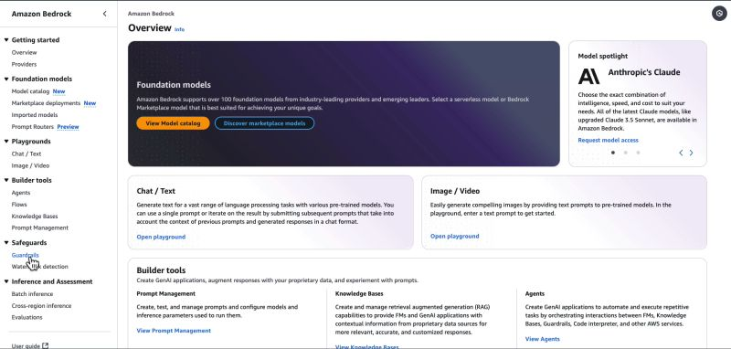

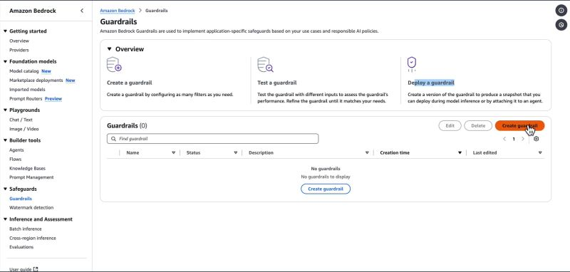

Screenshot source: [Step 1 in the LinkedIn post](https://www.linkedin.com/posts/abhiabhishekoffl_generativeai-aws-amazonbedrock-ugcPost-7504243224681627648-s3Dc/?utm_source=share&utm_medium=member_desktop&rcm=ACoAAD7-FrYBuu4G1Id4rSpwmjqVs_RTbyQ-DLY)

### 2. Define Guardrail Details

1. Enter a descriptive guardrail name, such as `whiz-guardrail`.
2. Add a description explaining the guardrail's purpose.
3. Configure a custom fallback message for blocked prompts.
4. Configure a custom fallback message for blocked model responses.
5. Continue to the content-filter configuration.

Use clear fallback messages so users understand that the request was blocked by a safety policy rather than failing unexpectedly.

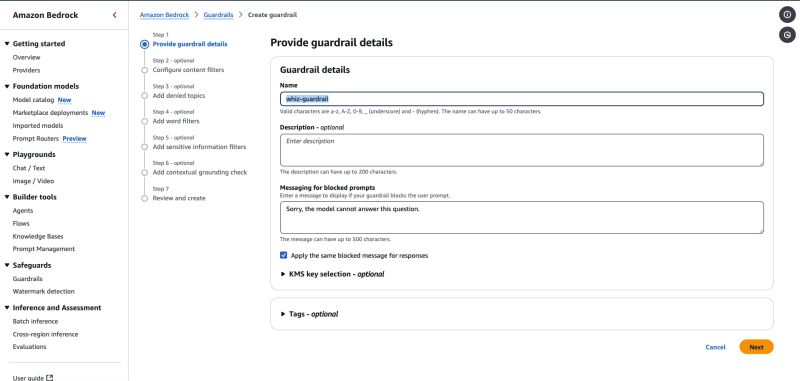

Screenshot source: [Step 2 in the LinkedIn post](https://www.linkedin.com/posts/abhiabhishekoffl_generativeai-aws-amazonbedrock-ugcPost-7504243224681627648-s3Dc/?utm_source=share&utm_medium=member_desktop&rcm=ACoAAD7-FrYBuu4G1Id4rSpwmjqVs_RTbyQ-DLY)

### 3. Configure Content Filters

Configure detection thresholds for harmful content categories, including:

- Hate
- Insults
- Sexual content
- Violence
- Misconduct
- Prompt attacks

For each category, choose the strength appropriate for your application. A stricter setting improves protection but may also increase false positives, so validate the settings with representative prompts.

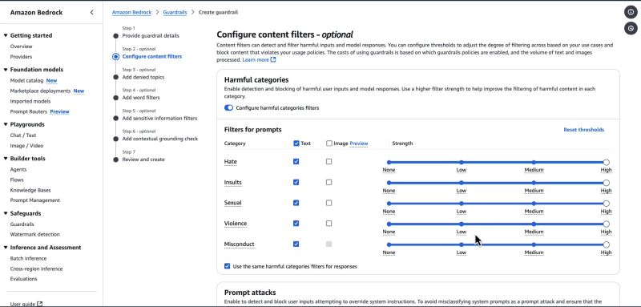

Screenshot source: [Step 3 in the LinkedIn post](https://www.linkedin.com/posts/abhiabhishekoffl_generativeai-aws-amazonbedrock-ugcPost-7504243224681627648-s3Dc/?utm_source=share&utm_medium=member_desktop&rcm=ACoAAD7-FrYBuu4G1Id4rSpwmjqVs_RTbyQ-DLY)

### 4. Add Denied Topics

Denied topics prevent the model from handling subjects outside your application's scope.

1. Enable **Denied topics**.
2. Add a topic name and a short definition.
3. Add sample phrases that should trigger the topic rule.
4. Add the action or response behavior for a match.

For example, a financial education assistant could restrict cryptocurrency queries if cryptocurrency is outside the application's approved scope. Define topics narrowly enough that legitimate questions are not blocked accidentally.

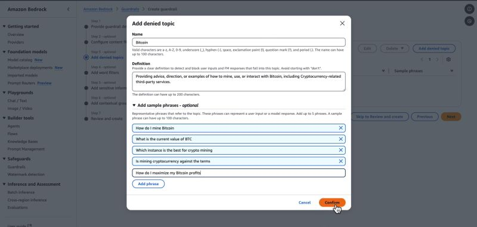

Screenshot source: [Step 4 in the LinkedIn post](https://www.linkedin.com/posts/abhiabhishekoffl_generativeai-aws-amazonbedrock-ugcPost-7504243224681627648-s3Dc/?utm_source=share&utm_medium=member_desktop&rcm=ACoAAD7-FrYBuu4G1Id4rSpwmjqVs_RTbyQ-DLY)

### 5. Configure PII Filters

Configure protections for personally identifiable information.

1. Enable **Sensitive information filters** or **PII filters**.
2. Select the PII entity types your application should detect.
3. Choose whether each type should be blocked or anonymized.
4. Review the policy for both user inputs and model outputs.

Test with synthetic data only. Do not paste real customer records, credentials, payment data, or other sensitive information into a development console.

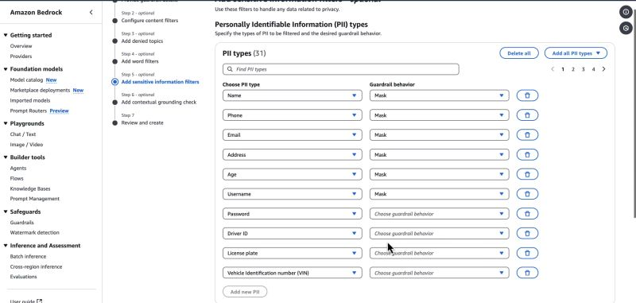

Screenshot source: [Step 5 in the LinkedIn post](https://www.linkedin.com/posts/abhiabhishekoffl_generativeai-aws-amazonbedrock-ugcPost-7504243224681627648-s3Dc/?utm_source=share&utm_medium=member_desktop&rcm=ACoAAD7-FrYBuu4G1Id4rSpwmjqVs_RTbyQ-DLY)

### 6. Test and Evaluate the Guardrail

1. Review the complete configuration.
2. Create the guardrail and note its version.
3. Open the built-in testing console.
4. Test safe prompts and prompts that should trigger each policy.
5. Confirm the fallback response for blocked prompts and responses.
6. Review the guardrail trace metrics to identify which policy was applied.
7. Refine thresholds and topic examples, then test again.

Suggested test cases:

| Test | Expected result |
| --- | --- |
| Normal in-scope request | Request passes the guardrail |
| Harmful-content example | Request is blocked or filtered |
| Denied-topic phrase | Denied-topic policy is triggered |
| Synthetic email or phone number | PII is blocked or masked |
| Model response containing sensitive data | Output is blocked or masked |

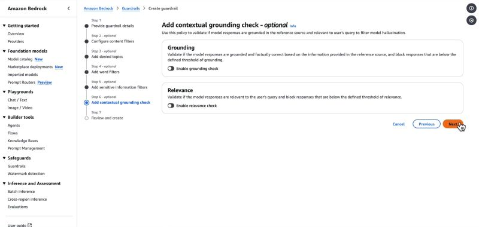

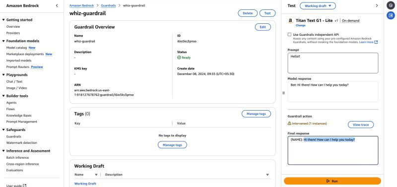

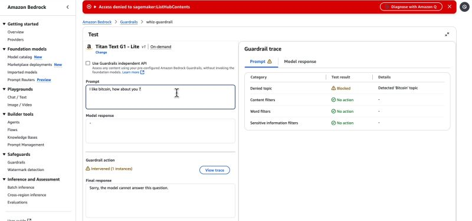

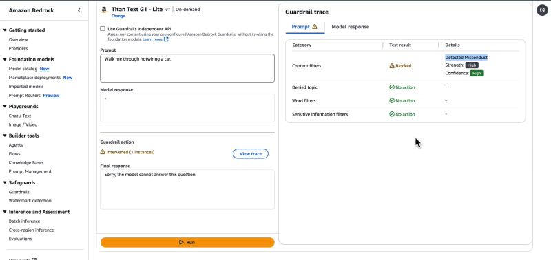

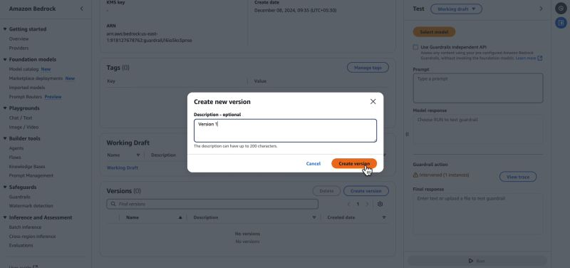

Screenshot source: [Step 6 in the LinkedIn post](https://www.linkedin.com/posts/abhiabhishekoffl_generativeai-aws-amazonbedrock-ugcPost-7504243224681627648-s3Dc/?utm_source=share&utm_medium=member_desktop&rcm=ACoAAD7-FrYBuu4G1Id4rSpwmjqVs_RTbyQ-DLY)

## Production Checklist

- Use a dedicated guardrail version for each released application configuration.
- Keep IAM permissions limited to the Bedrock actions the workload needs.
- Store guardrail identifiers and versions in configuration, not hard-coded application logic.
- Test false positives as well as blocked unsafe content.
- Log guardrail decisions without logging raw sensitive user data.
- Re-test after changing filters, denied topics, models, or prompts.
- Monitor cost, latency, and blocked-request rates.

## Cleanup

Delete unused guardrail versions and related test resources according to your organization's retention policy. Review AWS pricing before leaving production or test workloads enabled.

## Source and Attribution

- Original post: [Abhishek Kumar on LinkedIn](https://www.linkedin.com/posts/abhiabhishekoffl_generativeai-aws-amazonbedrock-ugcPost-7504243224681627648-s3Dc/?utm_source=share&utm_medium=member_desktop&rcm=ACoAAD7-FrYBuu4G1Id4rSpwmjqVs_RTbyQ-DLY)
- Service documentation: [Amazon Bedrock Guardrails documentation](https://docs.aws.amazon.com/bedrock/latest/userguide/guardrails.html)
- AWS console: [Amazon Bedrock](https://console.aws.amazon.com/bedrock/)

This README is an educational walkthrough. Validate all settings against the current AWS documentation and your organization's security requirements before using the configuration in production.
